## Resource Demand Extraction
Job categories used for analysis:

- reprocessing: 141330 reports
- production: 26545 reports
- analysis: 6723 reports
- hctest: 4492 reports
- relval: 2302 reports

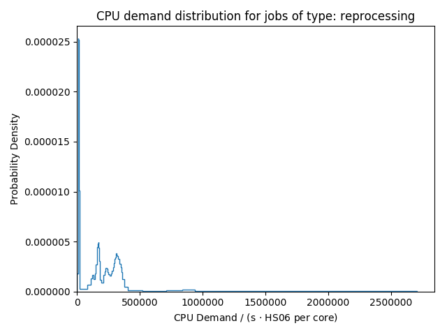

Figure in other image formats: [png](figures-sampling/cpu_demands_type_reprocessing.png), [pdf](figures-sampling/cpu_demands_type_reprocessing.pdf)

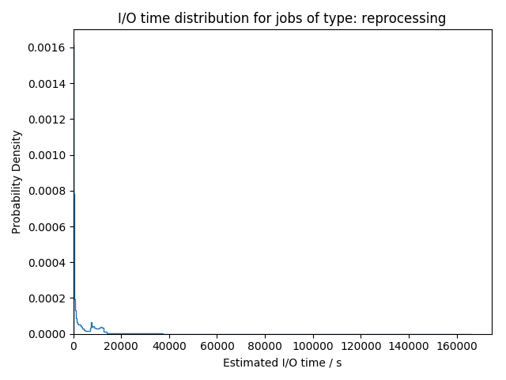

Figure in other image formats: [png](figures-sampling/io_time_type_reprocessing.png), [pdf](figures-sampling/io_time_type_reprocessing.pdf)

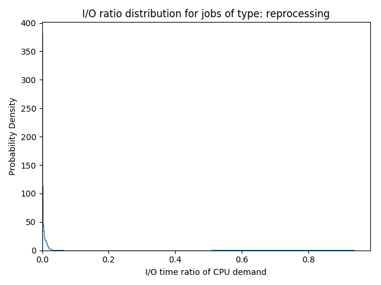

Figure in other image formats: [png](figures-sampling/io_ratio_type_reprocessing.png), [pdf](figures-sampling/io_ratio_type_reprocessing.pdf)

### Demands per Event

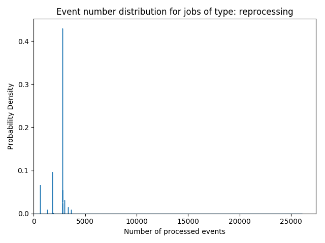

Figure in other image formats: [png](figures-sampling/event_counts_type_reprocessing.png), [pdf](figures-sampling/event_counts_type_reprocessing.pdf)

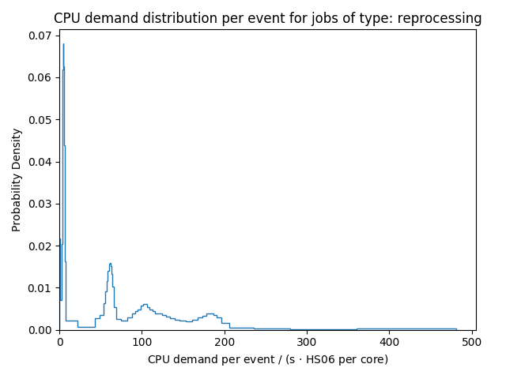

Figure in other image formats: [png](figures-sampling/cpu_demand_per_event_type_reprocessing.png), [pdf](figures-sampling/cpu_demand_per_event_type_reprocessing.pdf)

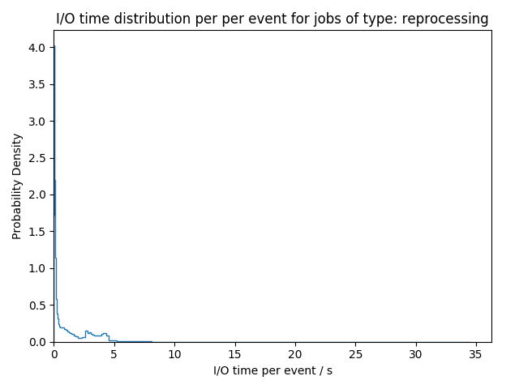

Figure in other image formats: [png](figures-sampling/io_time_per_event_type_reprocessing.png), [pdf](figures-sampling/io_time_per_event_type_reprocessing.pdf)

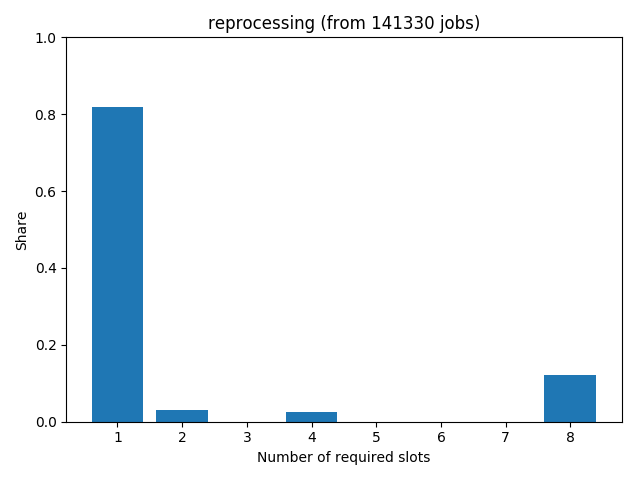

Figure in other image formats: [png](figures-sampling/jobslots_type_reprocessing.png), [pdf](figures-sampling/jobslots_type_reprocessing.pdf)

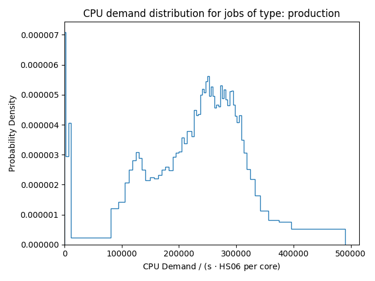

Figure in other image formats: [png](figures-sampling/cpu_demands_type_production.png), [pdf](figures-sampling/cpu_demands_type_production.pdf)

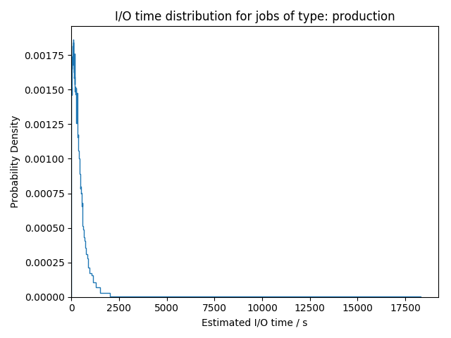

Figure in other image formats: [png](figures-sampling/io_time_type_production.png), [pdf](figures-sampling/io_time_type_production.pdf)

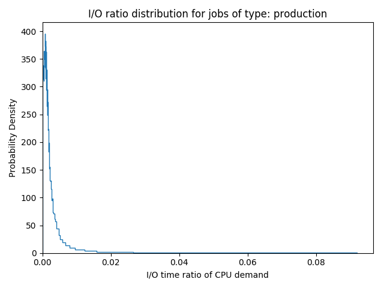

Figure in other image formats: [png](figures-sampling/io_ratio_type_production.png), [pdf](figures-sampling/io_ratio_type_production.pdf)

### Demands per Event

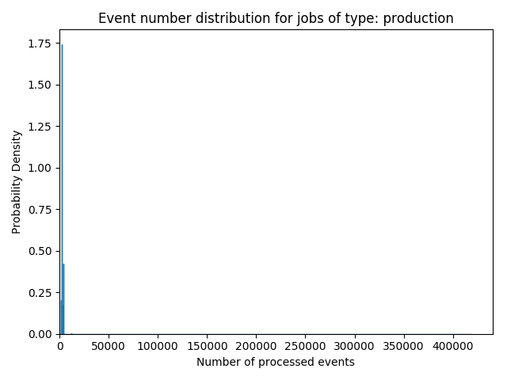

Figure in other image formats: [png](figures-sampling/event_counts_type_production.png), [pdf](figures-sampling/event_counts_type_production.pdf)

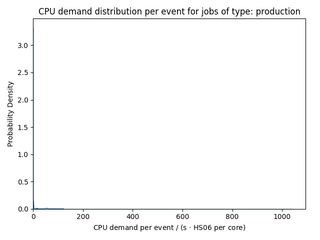

Figure in other image formats: [png](figures-sampling/cpu_demand_per_event_type_production.png), [pdf](figures-sampling/cpu_demand_per_event_type_production.pdf)

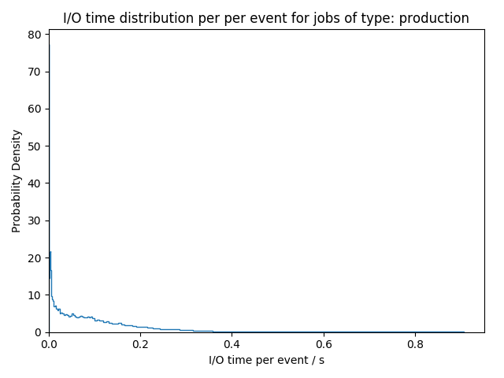

Figure in other image formats: [png](figures-sampling/io_time_per_event_type_production.png), [pdf](figures-sampling/io_time_per_event_type_production.pdf)

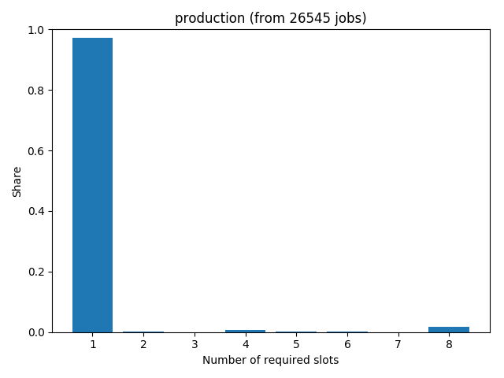

Figure in other image formats: [png](figures-sampling/jobslots_type_production.png), [pdf](figures-sampling/jobslots_type_production.pdf)

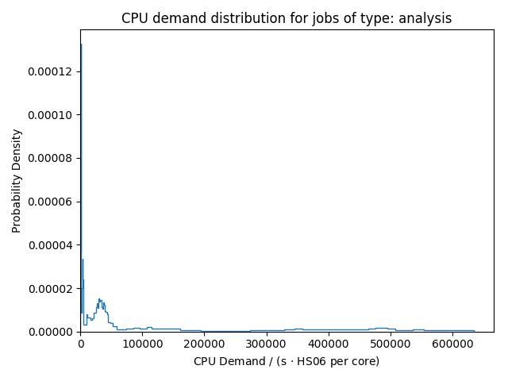

Figure in other image formats: [png](figures-sampling/cpu_demands_type_analysis.png), [pdf](figures-sampling/cpu_demands_type_analysis.pdf)

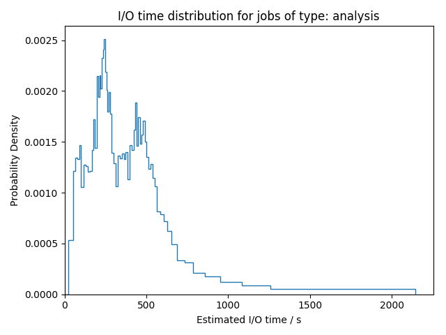

Figure in other image formats: [png](figures-sampling/io_time_type_analysis.png), [pdf](figures-sampling/io_time_type_analysis.pdf)

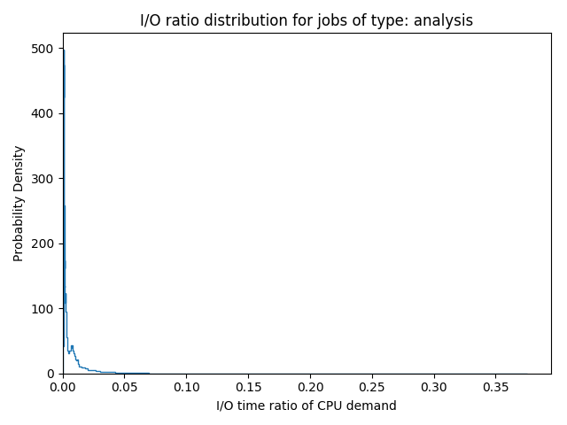

Figure in other image formats: [png](figures-sampling/io_ratio_type_analysis.png), [pdf](figures-sampling/io_ratio_type_analysis.pdf)

### Demands per Event

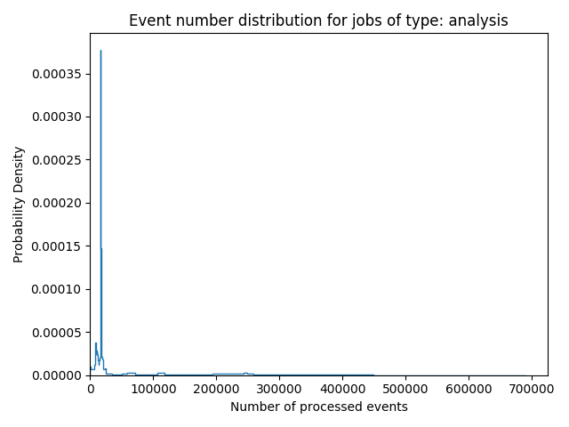

Figure in other image formats: [png](figures-sampling/event_counts_type_analysis.png), [pdf](figures-sampling/event_counts_type_analysis.pdf)

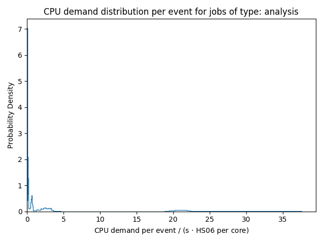

Figure in other image formats: [png](figures-sampling/cpu_demand_per_event_type_analysis.png), [pdf](figures-sampling/cpu_demand_per_event_type_analysis.pdf)

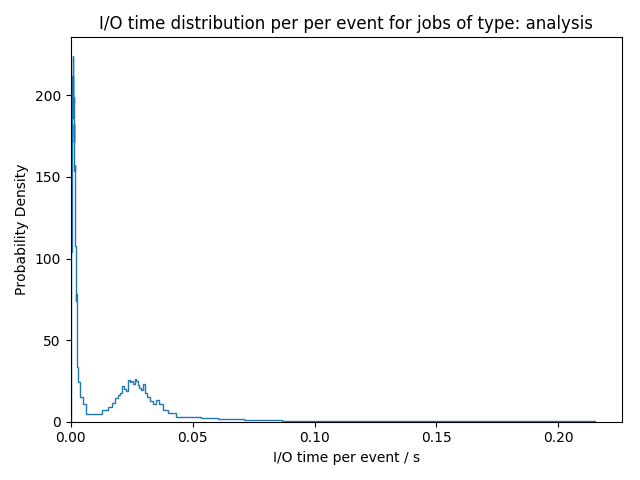

Figure in other image formats: [png](figures-sampling/io_time_per_event_type_analysis.png), [pdf](figures-sampling/io_time_per_event_type_analysis.pdf)

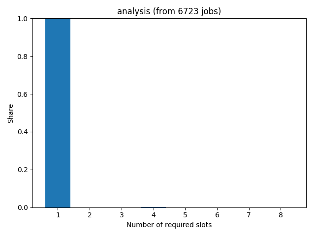

Figure in other image formats: [png](figures-sampling/jobslots_type_analysis.png), [pdf](figures-sampling/jobslots_type_analysis.pdf)

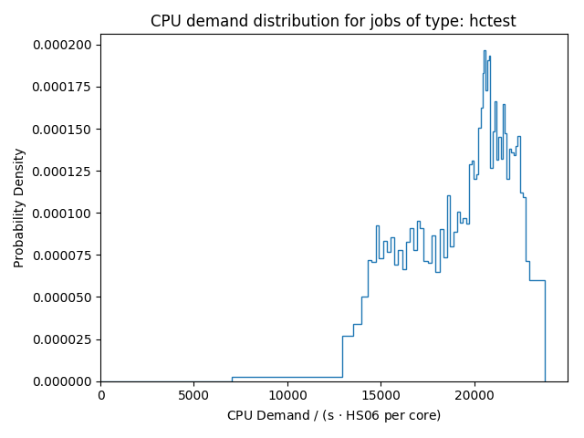

Figure in other image formats: [png](figures-sampling/cpu_demands_type_hctest.png), [pdf](figures-sampling/cpu_demands_type_hctest.pdf)

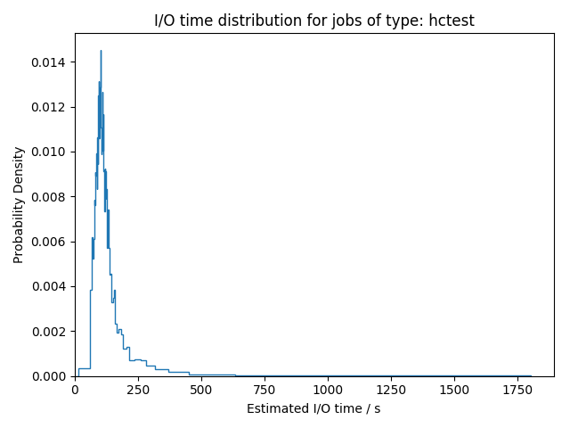

Figure in other image formats: [png](figures-sampling/io_time_type_hctest.png), [pdf](figures-sampling/io_time_type_hctest.pdf)

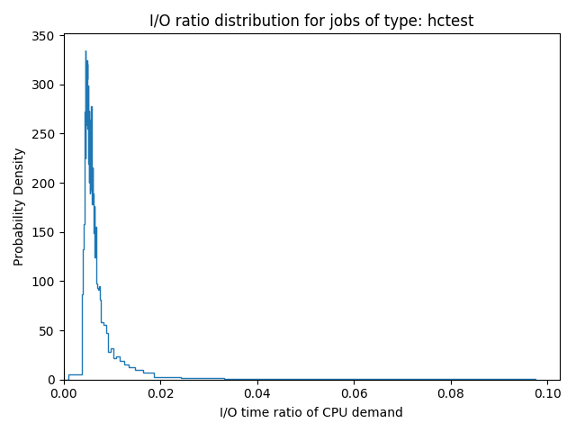

Figure in other image formats: [png](figures-sampling/io_ratio_type_hctest.png), [pdf](figures-sampling/io_ratio_type_hctest.pdf)

### Demands per Event

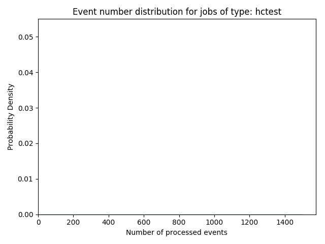

Figure in other image formats: [png](figures-sampling/event_counts_type_hctest.png), [pdf](figures-sampling/event_counts_type_hctest.pdf)

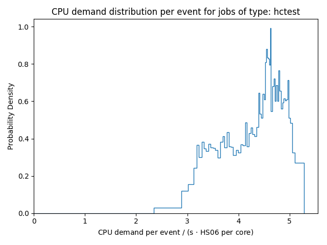

Figure in other image formats: [png](figures-sampling/cpu_demand_per_event_type_hctest.png), [pdf](figures-sampling/cpu_demand_per_event_type_hctest.pdf)

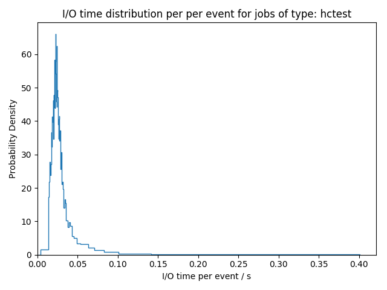

Figure in other image formats: [png](figures-sampling/io_time_per_event_type_hctest.png), [pdf](figures-sampling/io_time_per_event_type_hctest.pdf)

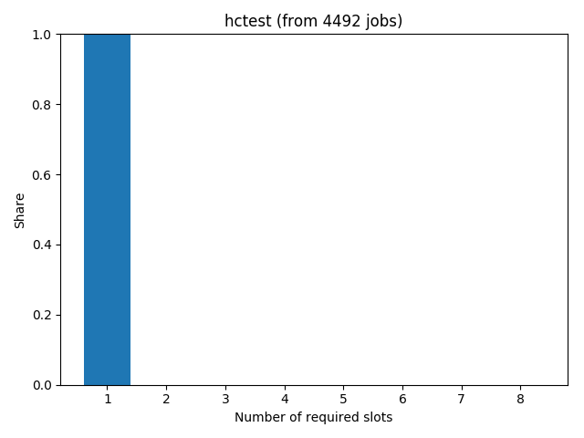

Figure in other image formats: [png](figures-sampling/jobslots_type_hctest.png), [pdf](figures-sampling/jobslots_type_hctest.pdf)

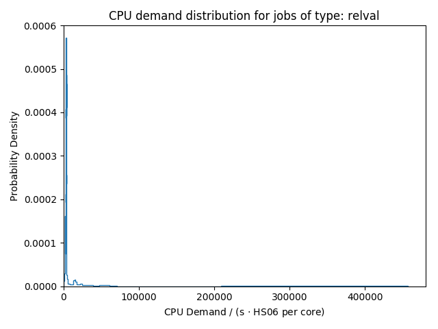

Figure in other image formats: [png](figures-sampling/cpu_demands_type_relval.png), [pdf](figures-sampling/cpu_demands_type_relval.pdf)

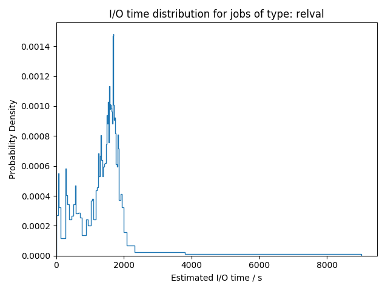

Figure in other image formats: [png](figures-sampling/io_time_type_relval.png), [pdf](figures-sampling/io_time_type_relval.pdf)

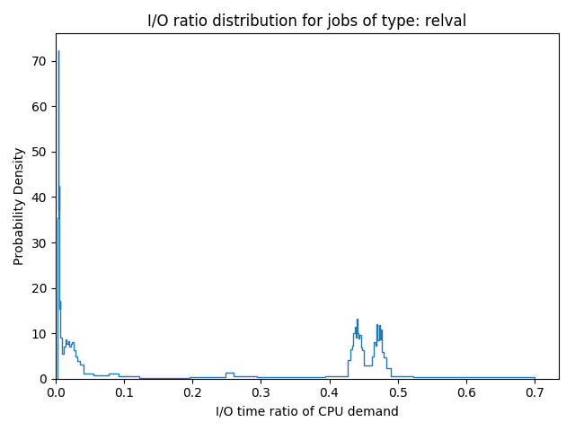

Figure in other image formats: [png](figures-sampling/io_ratio_type_relval.png), [pdf](figures-sampling/io_ratio_type_relval.pdf)

### Demands per Event

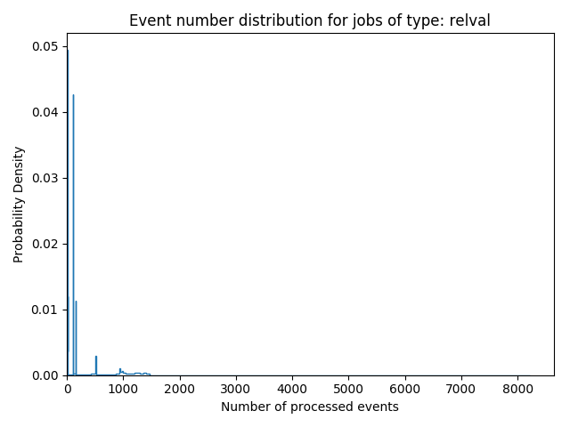

Figure in other image formats: [png](figures-sampling/event_counts_type_relval.png), [pdf](figures-sampling/event_counts_type_relval.pdf)

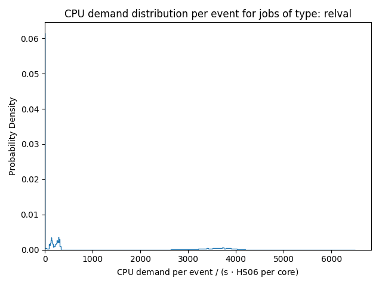

Figure in other image formats: [png](figures-sampling/cpu_demand_per_event_type_relval.png), [pdf](figures-sampling/cpu_demand_per_event_type_relval.pdf)

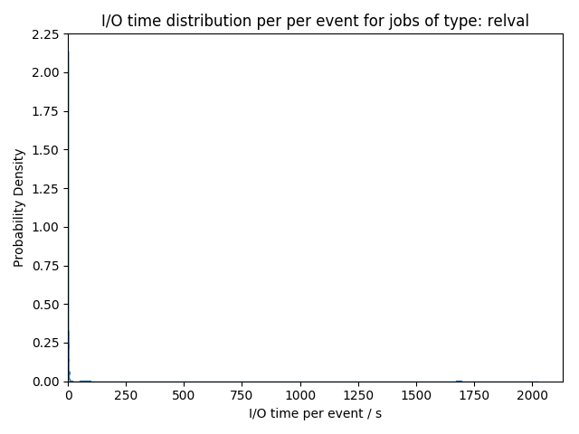

Figure in other image formats: [png](figures-sampling/io_time_per_event_type_relval.png), [pdf](figures-sampling/io_time_per_event_type_relval.pdf)

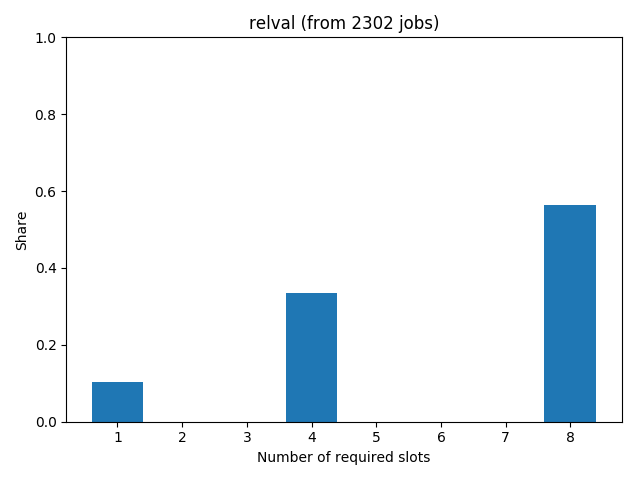

Figure in other image formats: [png](figures-sampling/jobslots_type_relval.png), [pdf](figures-sampling/jobslots_type_relval.pdf)

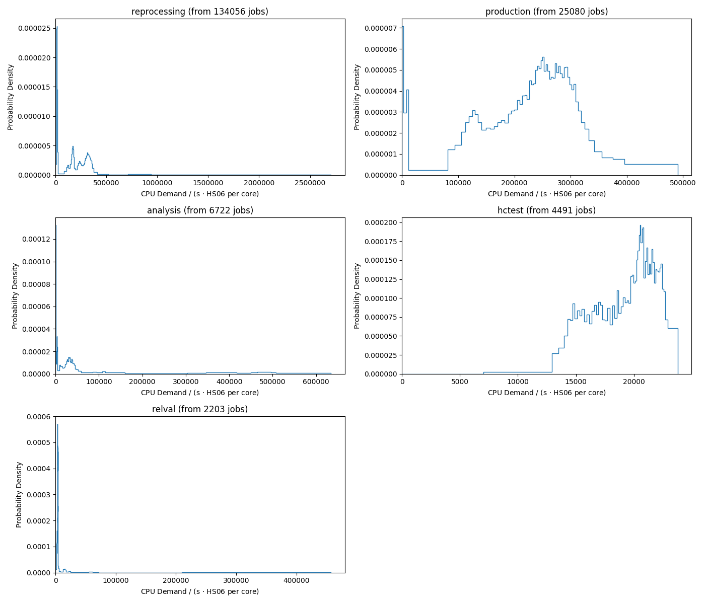

Figure in other image formats: [png](figures-sampling/cpu_demand_overview.png), [pdf](figures-sampling/cpu_demand_overview.pdf)

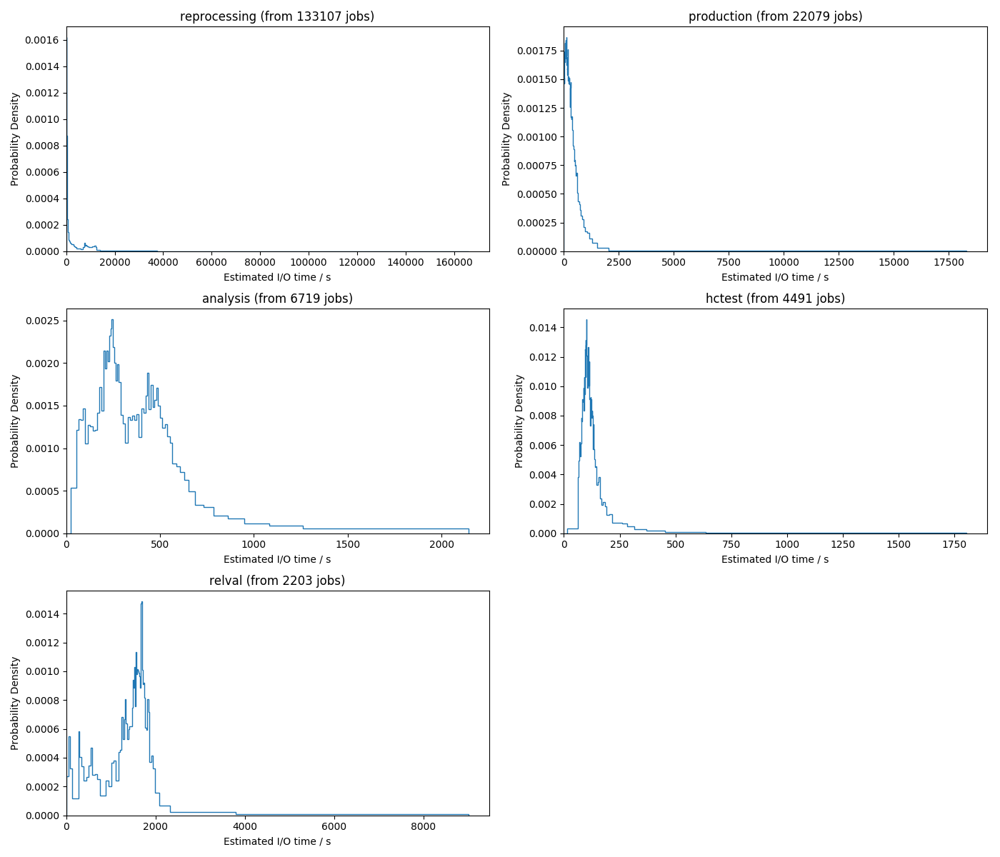

Figure in other image formats: [png](figures-sampling/io_demand_overview.png), [pdf](figures-sampling/io_demand_overview.pdf)

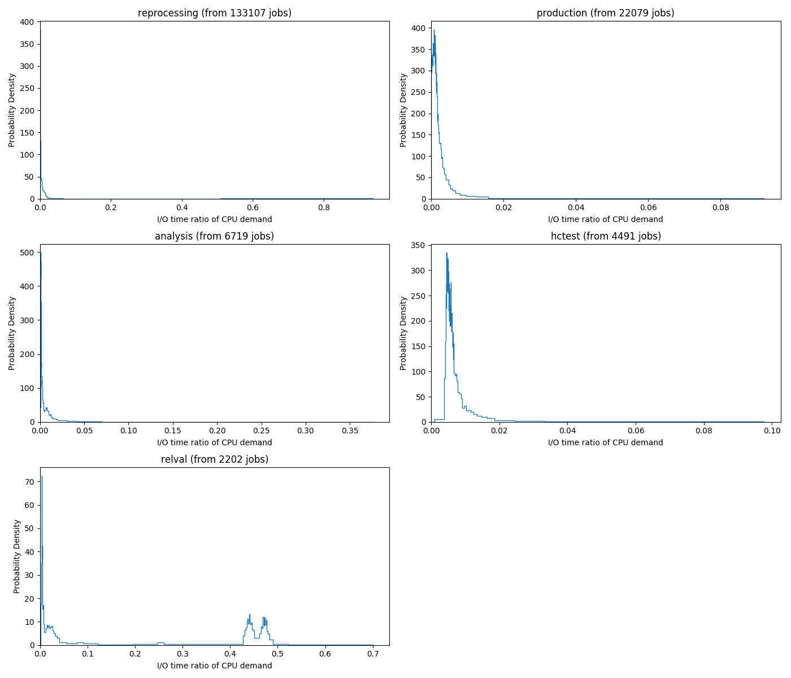

Figure in other image formats: [png](figures-sampling/io_ratio_overview.png), [pdf](figures-sampling/io_ratio_overview.pdf)

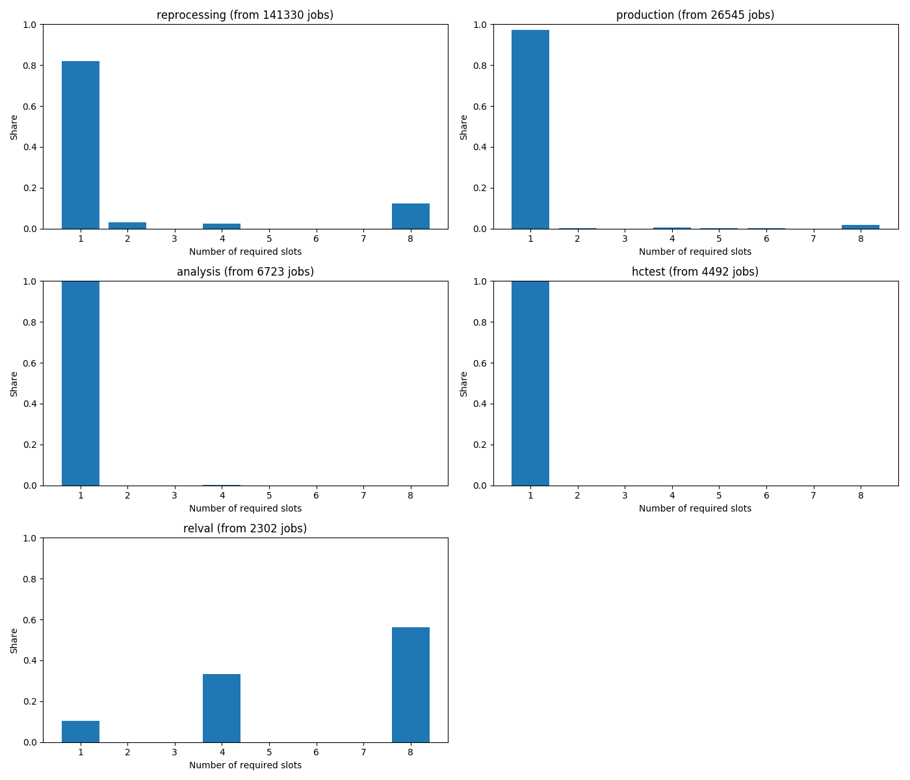

Figure in other image formats: [png](figures-sampling/jobslots_overview.png), [pdf](figures-sampling/jobslots_overview.pdf)

