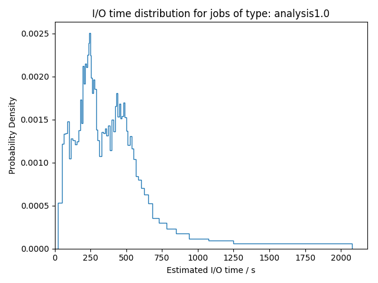
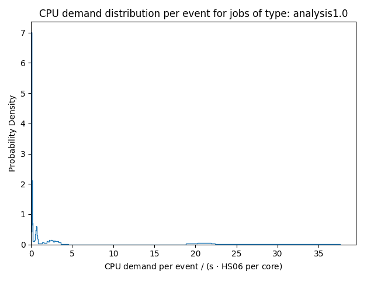
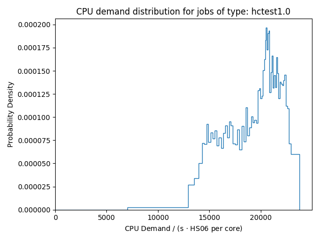
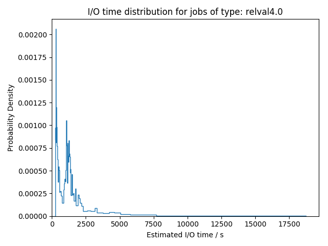
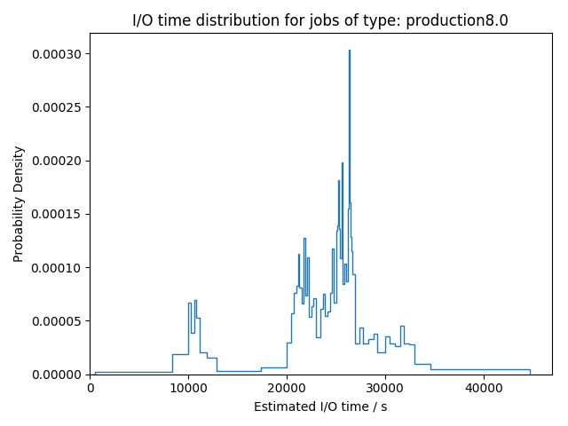
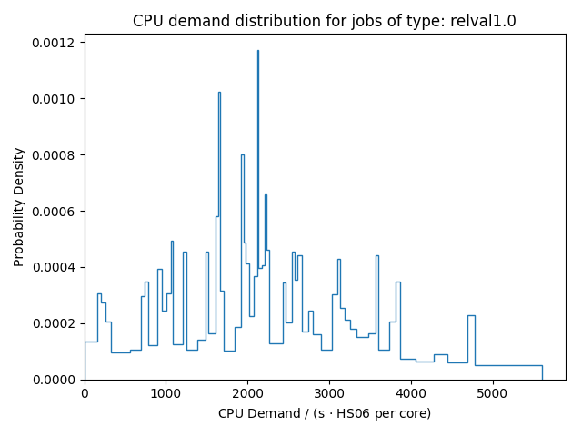

## Resource Demand Extraction
Job categories used for analysis:

- reprocessing1.0lower: 82520 reports
- reprocessing1.0upper: 26231 reports
- production1.0: 25815 reports
- reprocessing8.0: 17335 reports
- analysis1.0: 6714 reports
- hctest1.0: 4492 reports
- reprocessing2.0: 4488 reports
- reprocessing4.0: 3586 reports
- relval8.0: 1295 reports
- relval4.0: 769 reports
- production8.0: 462 reports
- relval1.0: 238 reports
- production4.0: 163 reports

Figure in other image formats: [png](figures-sampling/cpu_demands_type_reprocessing1.0lower.png), [pdf](figures-sampling/cpu_demands_type_reprocessing1.0lower.pdf)

Figure in other image formats: [png](figures-sampling/io_time_type_reprocessing1.0lower.png), [pdf](figures-sampling/io_time_type_reprocessing1.0lower.pdf)

Figure in other image formats: [png](figures-sampling/io_ratio_type_reprocessing1.0lower.png), [pdf](figures-sampling/io_ratio_type_reprocessing1.0lower.pdf)

### Demands per Event

Figure in other image formats: [png](figures-sampling/event_counts_type_reprocessing1.0lower.png), [pdf](figures-sampling/event_counts_type_reprocessing1.0lower.pdf)

Figure in other image formats: [png](figures-sampling/cpu_demand_per_event_type_reprocessing1.0lower.png), [pdf](figures-sampling/cpu_demand_per_event_type_reprocessing1.0lower.pdf)

Figure in other image formats: [png](figures-sampling/io_time_per_event_type_reprocessing1.0lower.png), [pdf](figures-sampling/io_time_per_event_type_reprocessing1.0lower.pdf)

Figure in other image formats: [png](figures-sampling/jobslots_type_reprocessing1.0lower.png), [pdf](figures-sampling/jobslots_type_reprocessing1.0lower.pdf)

Figure in other image formats: [png](figures-sampling/cpu_demands_type_reprocessing1.0upper.png), [pdf](figures-sampling/cpu_demands_type_reprocessing1.0upper.pdf)

Figure in other image formats: [png](figures-sampling/io_time_type_reprocessing1.0upper.png), [pdf](figures-sampling/io_time_type_reprocessing1.0upper.pdf)

Figure in other image formats: [png](figures-sampling/io_ratio_type_reprocessing1.0upper.png), [pdf](figures-sampling/io_ratio_type_reprocessing1.0upper.pdf)

### Demands per Event

Figure in other image formats: [png](figures-sampling/event_counts_type_reprocessing1.0upper.png), [pdf](figures-sampling/event_counts_type_reprocessing1.0upper.pdf)

Figure in other image formats: [png](figures-sampling/cpu_demand_per_event_type_reprocessing1.0upper.png), [pdf](figures-sampling/cpu_demand_per_event_type_reprocessing1.0upper.pdf)

Figure in other image formats: [png](figures-sampling/io_time_per_event_type_reprocessing1.0upper.png), [pdf](figures-sampling/io_time_per_event_type_reprocessing1.0upper.pdf)

Figure in other image formats: [png](figures-sampling/jobslots_type_reprocessing1.0upper.png), [pdf](figures-sampling/jobslots_type_reprocessing1.0upper.pdf)

Figure in other image formats: [png](figures-sampling/cpu_demands_type_production1.0.png), [pdf](figures-sampling/cpu_demands_type_production1.0.pdf)

Figure in other image formats: [png](figures-sampling/io_time_type_production1.0.png), [pdf](figures-sampling/io_time_type_production1.0.pdf)

Figure in other image formats: [png](figures-sampling/io_ratio_type_production1.0.png), [pdf](figures-sampling/io_ratio_type_production1.0.pdf)

### Demands per Event

Figure in other image formats: [png](figures-sampling/event_counts_type_production1.0.png), [pdf](figures-sampling/event_counts_type_production1.0.pdf)

Figure in other image formats: [png](figures-sampling/cpu_demand_per_event_type_production1.0.png), [pdf](figures-sampling/cpu_demand_per_event_type_production1.0.pdf)

Figure in other image formats: [png](figures-sampling/io_time_per_event_type_production1.0.png), [pdf](figures-sampling/io_time_per_event_type_production1.0.pdf)

Figure in other image formats: [png](figures-sampling/jobslots_type_production1.0.png), [pdf](figures-sampling/jobslots_type_production1.0.pdf)

Figure in other image formats: [png](figures-sampling/cpu_demands_type_reprocessing8.0.png), [pdf](figures-sampling/cpu_demands_type_reprocessing8.0.pdf)

Figure in other image formats: [png](figures-sampling/io_time_type_reprocessing8.0.png), [pdf](figures-sampling/io_time_type_reprocessing8.0.pdf)

Figure in other image formats: [png](figures-sampling/io_ratio_type_reprocessing8.0.png), [pdf](figures-sampling/io_ratio_type_reprocessing8.0.pdf)

### Demands per Event

Figure in other image formats: [png](figures-sampling/event_counts_type_reprocessing8.0.png), [pdf](figures-sampling/event_counts_type_reprocessing8.0.pdf)

Figure in other image formats: [png](figures-sampling/cpu_demand_per_event_type_reprocessing8.0.png), [pdf](figures-sampling/cpu_demand_per_event_type_reprocessing8.0.pdf)

Figure in other image formats: [png](figures-sampling/io_time_per_event_type_reprocessing8.0.png), [pdf](figures-sampling/io_time_per_event_type_reprocessing8.0.pdf)

Figure in other image formats: [png](figures-sampling/jobslots_type_reprocessing8.0.png), [pdf](figures-sampling/jobslots_type_reprocessing8.0.pdf)

Figure in other image formats: [png](figures-sampling/cpu_demands_type_analysis1.0.png), [pdf](figures-sampling/cpu_demands_type_analysis1.0.pdf)

Figure in other image formats: [png](figures-sampling/io_time_type_analysis1.0.png), [pdf](figures-sampling/io_time_type_analysis1.0.pdf)

Figure in other image formats: [png](figures-sampling/io_ratio_type_analysis1.0.png), [pdf](figures-sampling/io_ratio_type_analysis1.0.pdf)

### Demands per Event

Figure in other image formats: [png](figures-sampling/event_counts_type_analysis1.0.png), [pdf](figures-sampling/event_counts_type_analysis1.0.pdf)

Figure in other image formats: [png](figures-sampling/cpu_demand_per_event_type_analysis1.0.png), [pdf](figures-sampling/cpu_demand_per_event_type_analysis1.0.pdf)

Figure in other image formats: [png](figures-sampling/io_time_per_event_type_analysis1.0.png), [pdf](figures-sampling/io_time_per_event_type_analysis1.0.pdf)

Figure in other image formats: [png](figures-sampling/jobslots_type_analysis1.0.png), [pdf](figures-sampling/jobslots_type_analysis1.0.pdf)

Figure in other image formats: [png](figures-sampling/cpu_demands_type_hctest1.0.png), [pdf](figures-sampling/cpu_demands_type_hctest1.0.pdf)

Figure in other image formats: [png](figures-sampling/io_time_type_hctest1.0.png), [pdf](figures-sampling/io_time_type_hctest1.0.pdf)

Figure in other image formats: [png](figures-sampling/io_ratio_type_hctest1.0.png), [pdf](figures-sampling/io_ratio_type_hctest1.0.pdf)

### Demands per Event

Figure in other image formats: [png](figures-sampling/event_counts_type_hctest1.0.png), [pdf](figures-sampling/event_counts_type_hctest1.0.pdf)

Figure in other image formats: [png](figures-sampling/cpu_demand_per_event_type_hctest1.0.png), [pdf](figures-sampling/cpu_demand_per_event_type_hctest1.0.pdf)

Figure in other image formats: [png](figures-sampling/io_time_per_event_type_hctest1.0.png), [pdf](figures-sampling/io_time_per_event_type_hctest1.0.pdf)

Figure in other image formats: [png](figures-sampling/jobslots_type_hctest1.0.png), [pdf](figures-sampling/jobslots_type_hctest1.0.pdf)

Figure in other image formats: [png](figures-sampling/cpu_demands_type_reprocessing2.0.png), [pdf](figures-sampling/cpu_demands_type_reprocessing2.0.pdf)

Figure in other image formats: [png](figures-sampling/io_time_type_reprocessing2.0.png), [pdf](figures-sampling/io_time_type_reprocessing2.0.pdf)

Figure in other image formats: [png](figures-sampling/io_ratio_type_reprocessing2.0.png), [pdf](figures-sampling/io_ratio_type_reprocessing2.0.pdf)

### Demands per Event

Figure in other image formats: [png](figures-sampling/event_counts_type_reprocessing2.0.png), [pdf](figures-sampling/event_counts_type_reprocessing2.0.pdf)

Figure in other image formats: [png](figures-sampling/cpu_demand_per_event_type_reprocessing2.0.png), [pdf](figures-sampling/cpu_demand_per_event_type_reprocessing2.0.pdf)

Figure in other image formats: [png](figures-sampling/io_time_per_event_type_reprocessing2.0.png), [pdf](figures-sampling/io_time_per_event_type_reprocessing2.0.pdf)

Figure in other image formats: [png](figures-sampling/jobslots_type_reprocessing2.0.png), [pdf](figures-sampling/jobslots_type_reprocessing2.0.pdf)

Figure in other image formats: [png](figures-sampling/cpu_demands_type_reprocessing4.0.png), [pdf](figures-sampling/cpu_demands_type_reprocessing4.0.pdf)

Figure in other image formats: [png](figures-sampling/io_time_type_reprocessing4.0.png), [pdf](figures-sampling/io_time_type_reprocessing4.0.pdf)

Figure in other image formats: [png](figures-sampling/io_ratio_type_reprocessing4.0.png), [pdf](figures-sampling/io_ratio_type_reprocessing4.0.pdf)

### Demands per Event

Figure in other image formats: [png](figures-sampling/event_counts_type_reprocessing4.0.png), [pdf](figures-sampling/event_counts_type_reprocessing4.0.pdf)

Figure in other image formats: [png](figures-sampling/cpu_demand_per_event_type_reprocessing4.0.png), [pdf](figures-sampling/cpu_demand_per_event_type_reprocessing4.0.pdf)

Figure in other image formats: [png](figures-sampling/io_time_per_event_type_reprocessing4.0.png), [pdf](figures-sampling/io_time_per_event_type_reprocessing4.0.pdf)

Figure in other image formats: [png](figures-sampling/jobslots_type_reprocessing4.0.png), [pdf](figures-sampling/jobslots_type_reprocessing4.0.pdf)

Figure in other image formats: [png](figures-sampling/cpu_demands_type_relval8.0.png), [pdf](figures-sampling/cpu_demands_type_relval8.0.pdf)

Figure in other image formats: [png](figures-sampling/io_time_type_relval8.0.png), [pdf](figures-sampling/io_time_type_relval8.0.pdf)

Figure in other image formats: [png](figures-sampling/io_ratio_type_relval8.0.png), [pdf](figures-sampling/io_ratio_type_relval8.0.pdf)

### Demands per Event

Figure in other image formats: [png](figures-sampling/event_counts_type_relval8.0.png), [pdf](figures-sampling/event_counts_type_relval8.0.pdf)

Figure in other image formats: [png](figures-sampling/cpu_demand_per_event_type_relval8.0.png), [pdf](figures-sampling/cpu_demand_per_event_type_relval8.0.pdf)

Figure in other image formats: [png](figures-sampling/io_time_per_event_type_relval8.0.png), [pdf](figures-sampling/io_time_per_event_type_relval8.0.pdf)

Figure in other image formats: [png](figures-sampling/jobslots_type_relval8.0.png), [pdf](figures-sampling/jobslots_type_relval8.0.pdf)

Figure in other image formats: [png](figures-sampling/cpu_demands_type_relval4.0.png), [pdf](figures-sampling/cpu_demands_type_relval4.0.pdf)

Figure in other image formats: [png](figures-sampling/io_time_type_relval4.0.png), [pdf](figures-sampling/io_time_type_relval4.0.pdf)

Figure in other image formats: [png](figures-sampling/io_ratio_type_relval4.0.png), [pdf](figures-sampling/io_ratio_type_relval4.0.pdf)

### Demands per Event

Figure in other image formats: [png](figures-sampling/event_counts_type_relval4.0.png), [pdf](figures-sampling/event_counts_type_relval4.0.pdf)

Figure in other image formats: [png](figures-sampling/cpu_demand_per_event_type_relval4.0.png), [pdf](figures-sampling/cpu_demand_per_event_type_relval4.0.pdf)

Figure in other image formats: [png](figures-sampling/io_time_per_event_type_relval4.0.png), [pdf](figures-sampling/io_time_per_event_type_relval4.0.pdf)

Figure in other image formats: [png](figures-sampling/jobslots_type_relval4.0.png), [pdf](figures-sampling/jobslots_type_relval4.0.pdf)

Figure in other image formats: [png](figures-sampling/cpu_demands_type_production8.0.png), [pdf](figures-sampling/cpu_demands_type_production8.0.pdf)

Figure in other image formats: [png](figures-sampling/io_time_type_production8.0.png), [pdf](figures-sampling/io_time_type_production8.0.pdf)

Figure in other image formats: [png](figures-sampling/io_ratio_type_production8.0.png), [pdf](figures-sampling/io_ratio_type_production8.0.pdf)

### Demands per Event

Figure in other image formats: [png](figures-sampling/event_counts_type_production8.0.png), [pdf](figures-sampling/event_counts_type_production8.0.pdf)

Figure in other image formats: [png](figures-sampling/cpu_demand_per_event_type_production8.0.png), [pdf](figures-sampling/cpu_demand_per_event_type_production8.0.pdf)

Figure in other image formats: [png](figures-sampling/io_time_per_event_type_production8.0.png), [pdf](figures-sampling/io_time_per_event_type_production8.0.pdf)

Figure in other image formats: [png](figures-sampling/jobslots_type_production8.0.png), [pdf](figures-sampling/jobslots_type_production8.0.pdf)

Figure in other image formats: [png](figures-sampling/cpu_demands_type_relval1.0.png), [pdf](figures-sampling/cpu_demands_type_relval1.0.pdf)

Figure in other image formats: [png](figures-sampling/io_time_type_relval1.0.png), [pdf](figures-sampling/io_time_type_relval1.0.pdf)

Figure in other image formats: [png](figures-sampling/io_ratio_type_relval1.0.png), [pdf](figures-sampling/io_ratio_type_relval1.0.pdf)

### Demands per Event

Figure in other image formats: [png](figures-sampling/event_counts_type_relval1.0.png), [pdf](figures-sampling/event_counts_type_relval1.0.pdf)

Figure in other image formats: [png](figures-sampling/cpu_demand_per_event_type_relval1.0.png), [pdf](figures-sampling/cpu_demand_per_event_type_relval1.0.pdf)

Figure in other image formats: [png](figures-sampling/io_time_per_event_type_relval1.0.png), [pdf](figures-sampling/io_time_per_event_type_relval1.0.pdf)

Figure in other image formats: [png](figures-sampling/jobslots_type_relval1.0.png), [pdf](figures-sampling/jobslots_type_relval1.0.pdf)

Figure in other image formats: [png](figures-sampling/cpu_demands_type_production4.0.png), [pdf](figures-sampling/cpu_demands_type_production4.0.pdf)

Figure in other image formats: [png](figures-sampling/io_time_type_production4.0.png), [pdf](figures-sampling/io_time_type_production4.0.pdf)

Figure in other image formats: [png](figures-sampling/io_ratio_type_production4.0.png), [pdf](figures-sampling/io_ratio_type_production4.0.pdf)

### Demands per Event

Figure in other image formats: [png](figures-sampling/event_counts_type_production4.0.png), [pdf](figures-sampling/event_counts_type_production4.0.pdf)

Figure in other image formats: [png](figures-sampling/cpu_demand_per_event_type_production4.0.png), [pdf](figures-sampling/cpu_demand_per_event_type_production4.0.pdf)

Figure in other image formats: [png](figures-sampling/io_time_per_event_type_production4.0.png), [pdf](figures-sampling/io_time_per_event_type_production4.0.pdf)

Figure in other image formats: [png](figures-sampling/jobslots_type_production4.0.png), [pdf](figures-sampling/jobslots_type_production4.0.pdf)

Figure in other image formats: [png](figures-sampling/cpu_demand_overview.png), [pdf](figures-sampling/cpu_demand_overview.pdf)

Figure in other image formats: [png](figures-sampling/io_demand_overview.png), [pdf](figures-sampling/io_demand_overview.pdf)

Figure in other image formats: [png](figures-sampling/io_ratio_overview.png), [pdf](figures-sampling/io_ratio_overview.pdf)

Figure in other image formats: [png](figures-sampling/jobslots_overview.png), [pdf](figures-sampling/jobslots_overview.pdf)

