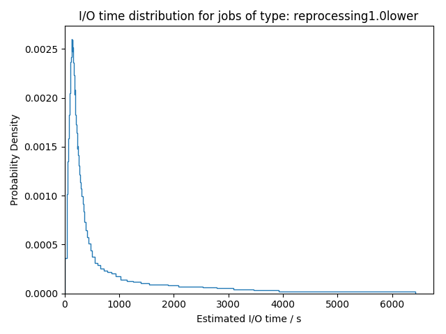
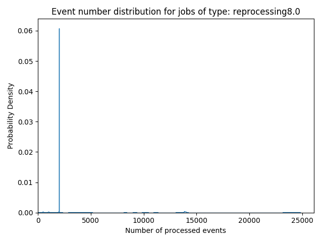
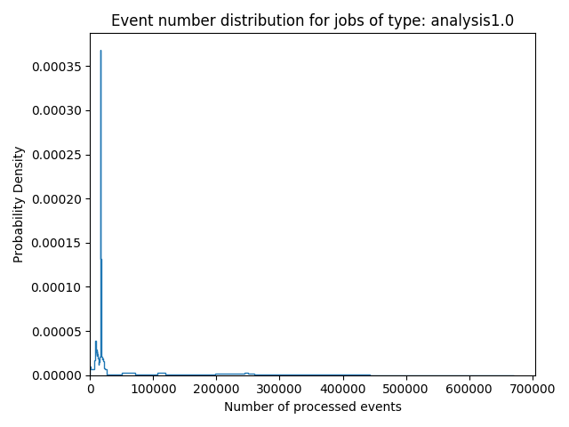
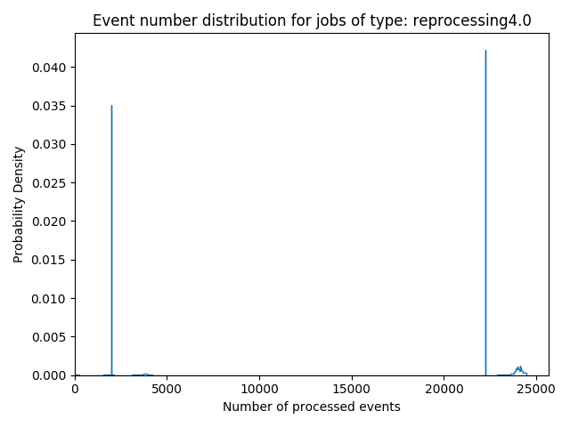
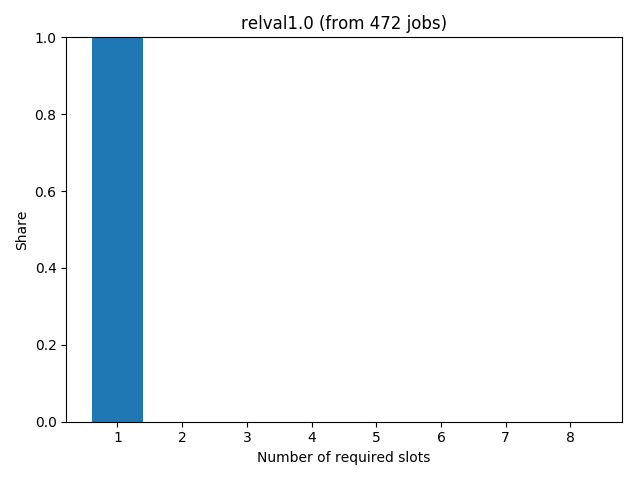
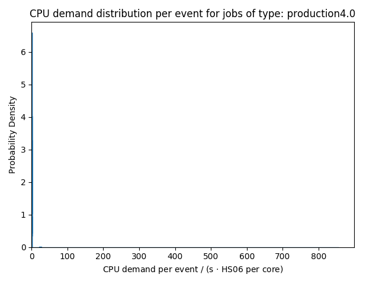

# GridKa Calibration Run
at 2018-08-30, 19:45:08

Start date: 2018-05-01 00:00:00  
End date: 2018-06-01 00:00:00


Figure in other image formats: [png](figures/jobslot_usage_reference.png), [pdf](figures/jobslot_usage_reference.pdf)

## Number of jobs completed over time


Figure in other image formats: [png](figures/job_counts_reference.png), [pdf](figures/job_counts_reference.pdf)

Job throughput from CMS Dashboard:


```
           type   count     share  throughput_day
0      analysis   26047  0.058921      840.225806
1        hctest    9012  0.020386      290.709677
2      hcxrootd      34  0.000077        1.096774
3    production   59745  0.135149     1927.258065
4        relval    4943  0.011182      159.451613
5  reprocessing  342287  0.774286    11041.516129
6       unknown       0  0.000000        0.000000
```


Figure in other image formats: [png](figures/cpu_efficiencies_reference.png), [pdf](figures/cpu_efficiencies_reference.pdf)

## Resource Demand Extraction
Job categories used for analysis:

- reprocessing1.0lower: 165158 reports
- reprocessing1.0upper: 52628 reports
- production1.0: 51492 reports
- reprocessing8.0: 34648 reports
- analysis1.0: 13365 reports
- hctest1.0: 8916 reports
- reprocessing2.0: 8875 reports
- reprocessing4.0: 7076 reports
- relval8.0: 2646 reports
- relval4.0: 1561 reports
- production8.0: 939 reports
- relval1.0: 472 reports
- production4.0: 337 reports


Figure in other image formats: [png](figures/cpu_demands_type_reprocessing1.0lower.png), [pdf](figures/cpu_demands_type_reprocessing1.0lower.pdf)



Figure in other image formats: [png](figures/io_time_type_reprocessing1.0lower.png), [pdf](figures/io_time_type_reprocessing1.0lower.pdf)


Figure in other image formats: [png](figures/io_ratio_type_reprocessing1.0lower.png), [pdf](figures/io_ratio_type_reprocessing1.0lower.pdf)

### Demands per Event


Figure in other image formats: [png](figures/event_counts_type_reprocessing1.0lower.png), [pdf](figures/event_counts_type_reprocessing1.0lower.pdf)


Figure in other image formats: [png](figures/cpu_demand_per_event_type_reprocessing1.0lower.png), [pdf](figures/cpu_demand_per_event_type_reprocessing1.0lower.pdf)


Figure in other image formats: [png](figures/io_time_per_event_type_reprocessing1.0lower.png), [pdf](figures/io_time_per_event_type_reprocessing1.0lower.pdf)


Figure in other image formats: [png](figures/jobslots_type_reprocessing1.0lower.png), [pdf](figures/jobslots_type_reprocessing1.0lower.pdf)


Figure in other image formats: [png](figures/cpu_demands_type_reprocessing1.0upper.png), [pdf](figures/cpu_demands_type_reprocessing1.0upper.pdf)


Figure in other image formats: [png](figures/io_time_type_reprocessing1.0upper.png), [pdf](figures/io_time_type_reprocessing1.0upper.pdf)


Figure in other image formats: [png](figures/io_ratio_type_reprocessing1.0upper.png), [pdf](figures/io_ratio_type_reprocessing1.0upper.pdf)

### Demands per Event


Figure in other image formats: [png](figures/event_counts_type_reprocessing1.0upper.png), [pdf](figures/event_counts_type_reprocessing1.0upper.pdf)


Figure in other image formats: [png](figures/cpu_demand_per_event_type_reprocessing1.0upper.png), [pdf](figures/cpu_demand_per_event_type_reprocessing1.0upper.pdf)


Figure in other image formats: [png](figures/io_time_per_event_type_reprocessing1.0upper.png), [pdf](figures/io_time_per_event_type_reprocessing1.0upper.pdf)


Figure in other image formats: [png](figures/jobslots_type_reprocessing1.0upper.png), [pdf](figures/jobslots_type_reprocessing1.0upper.pdf)


Figure in other image formats: [png](figures/cpu_demands_type_production1.0.png), [pdf](figures/cpu_demands_type_production1.0.pdf)


Figure in other image formats: [png](figures/io_time_type_production1.0.png), [pdf](figures/io_time_type_production1.0.pdf)


Figure in other image formats: [png](figures/io_ratio_type_production1.0.png), [pdf](figures/io_ratio_type_production1.0.pdf)

### Demands per Event


Figure in other image formats: [png](figures/event_counts_type_production1.0.png), [pdf](figures/event_counts_type_production1.0.pdf)


Figure in other image formats: [png](figures/cpu_demand_per_event_type_production1.0.png), [pdf](figures/cpu_demand_per_event_type_production1.0.pdf)


Figure in other image formats: [png](figures/io_time_per_event_type_production1.0.png), [pdf](figures/io_time_per_event_type_production1.0.pdf)


Figure in other image formats: [png](figures/jobslots_type_production1.0.png), [pdf](figures/jobslots_type_production1.0.pdf)


Figure in other image formats: [png](figures/cpu_demands_type_reprocessing8.0.png), [pdf](figures/cpu_demands_type_reprocessing8.0.pdf)


Figure in other image formats: [png](figures/io_time_type_reprocessing8.0.png), [pdf](figures/io_time_type_reprocessing8.0.pdf)


Figure in other image formats: [png](figures/io_ratio_type_reprocessing8.0.png), [pdf](figures/io_ratio_type_reprocessing8.0.pdf)

### Demands per Event



Figure in other image formats: [png](figures/event_counts_type_reprocessing8.0.png), [pdf](figures/event_counts_type_reprocessing8.0.pdf)


Figure in other image formats: [png](figures/cpu_demand_per_event_type_reprocessing8.0.png), [pdf](figures/cpu_demand_per_event_type_reprocessing8.0.pdf)


Figure in other image formats: [png](figures/io_time_per_event_type_reprocessing8.0.png), [pdf](figures/io_time_per_event_type_reprocessing8.0.pdf)


Figure in other image formats: [png](figures/jobslots_type_reprocessing8.0.png), [pdf](figures/jobslots_type_reprocessing8.0.pdf)


Figure in other image formats: [png](figures/cpu_demands_type_analysis1.0.png), [pdf](figures/cpu_demands_type_analysis1.0.pdf)


Figure in other image formats: [png](figures/io_time_type_analysis1.0.png), [pdf](figures/io_time_type_analysis1.0.pdf)


Figure in other image formats: [png](figures/io_ratio_type_analysis1.0.png), [pdf](figures/io_ratio_type_analysis1.0.pdf)

### Demands per Event



Figure in other image formats: [png](figures/event_counts_type_analysis1.0.png), [pdf](figures/event_counts_type_analysis1.0.pdf)


Figure in other image formats: [png](figures/cpu_demand_per_event_type_analysis1.0.png), [pdf](figures/cpu_demand_per_event_type_analysis1.0.pdf)


Figure in other image formats: [png](figures/io_time_per_event_type_analysis1.0.png), [pdf](figures/io_time_per_event_type_analysis1.0.pdf)


Figure in other image formats: [png](figures/jobslots_type_analysis1.0.png), [pdf](figures/jobslots_type_analysis1.0.pdf)


Figure in other image formats: [png](figures/cpu_demands_type_hctest1.0.png), [pdf](figures/cpu_demands_type_hctest1.0.pdf)


Figure in other image formats: [png](figures/io_time_type_hctest1.0.png), [pdf](figures/io_time_type_hctest1.0.pdf)


Figure in other image formats: [png](figures/io_ratio_type_hctest1.0.png), [pdf](figures/io_ratio_type_hctest1.0.pdf)

### Demands per Event


Figure in other image formats: [png](figures/event_counts_type_hctest1.0.png), [pdf](figures/event_counts_type_hctest1.0.pdf)


Figure in other image formats: [png](figures/cpu_demand_per_event_type_hctest1.0.png), [pdf](figures/cpu_demand_per_event_type_hctest1.0.pdf)


Figure in other image formats: [png](figures/io_time_per_event_type_hctest1.0.png), [pdf](figures/io_time_per_event_type_hctest1.0.pdf)


Figure in other image formats: [png](figures/jobslots_type_hctest1.0.png), [pdf](figures/jobslots_type_hctest1.0.pdf)


Figure in other image formats: [png](figures/cpu_demands_type_reprocessing2.0.png), [pdf](figures/cpu_demands_type_reprocessing2.0.pdf)


Figure in other image formats: [png](figures/io_time_type_reprocessing2.0.png), [pdf](figures/io_time_type_reprocessing2.0.pdf)


Figure in other image formats: [png](figures/io_ratio_type_reprocessing2.0.png), [pdf](figures/io_ratio_type_reprocessing2.0.pdf)

### Demands per Event


Figure in other image formats: [png](figures/event_counts_type_reprocessing2.0.png), [pdf](figures/event_counts_type_reprocessing2.0.pdf)


Figure in other image formats: [png](figures/cpu_demand_per_event_type_reprocessing2.0.png), [pdf](figures/cpu_demand_per_event_type_reprocessing2.0.pdf)


Figure in other image formats: [png](figures/io_time_per_event_type_reprocessing2.0.png), [pdf](figures/io_time_per_event_type_reprocessing2.0.pdf)


Figure in other image formats: [png](figures/jobslots_type_reprocessing2.0.png), [pdf](figures/jobslots_type_reprocessing2.0.pdf)


Figure in other image formats: [png](figures/cpu_demands_type_reprocessing4.0.png), [pdf](figures/cpu_demands_type_reprocessing4.0.pdf)


Figure in other image formats: [png](figures/io_time_type_reprocessing4.0.png), [pdf](figures/io_time_type_reprocessing4.0.pdf)


Figure in other image formats: [png](figures/io_ratio_type_reprocessing4.0.png), [pdf](figures/io_ratio_type_reprocessing4.0.pdf)

### Demands per Event



Figure in other image formats: [png](figures/event_counts_type_reprocessing4.0.png), [pdf](figures/event_counts_type_reprocessing4.0.pdf)


Figure in other image formats: [png](figures/cpu_demand_per_event_type_reprocessing4.0.png), [pdf](figures/cpu_demand_per_event_type_reprocessing4.0.pdf)


Figure in other image formats: [png](figures/io_time_per_event_type_reprocessing4.0.png), [pdf](figures/io_time_per_event_type_reprocessing4.0.pdf)


Figure in other image formats: [png](figures/jobslots_type_reprocessing4.0.png), [pdf](figures/jobslots_type_reprocessing4.0.pdf)


Figure in other image formats: [png](figures/cpu_demands_type_relval8.0.png), [pdf](figures/cpu_demands_type_relval8.0.pdf)


Figure in other image formats: [png](figures/io_time_type_relval8.0.png), [pdf](figures/io_time_type_relval8.0.pdf)


Figure in other image formats: [png](figures/io_ratio_type_relval8.0.png), [pdf](figures/io_ratio_type_relval8.0.pdf)

### Demands per Event


Figure in other image formats: [png](figures/event_counts_type_relval8.0.png), [pdf](figures/event_counts_type_relval8.0.pdf)


Figure in other image formats: [png](figures/cpu_demand_per_event_type_relval8.0.png), [pdf](figures/cpu_demand_per_event_type_relval8.0.pdf)


Figure in other image formats: [png](figures/io_time_per_event_type_relval8.0.png), [pdf](figures/io_time_per_event_type_relval8.0.pdf)


Figure in other image formats: [png](figures/jobslots_type_relval8.0.png), [pdf](figures/jobslots_type_relval8.0.pdf)


Figure in other image formats: [png](figures/cpu_demands_type_relval4.0.png), [pdf](figures/cpu_demands_type_relval4.0.pdf)


Figure in other image formats: [png](figures/io_time_type_relval4.0.png), [pdf](figures/io_time_type_relval4.0.pdf)


Figure in other image formats: [png](figures/io_ratio_type_relval4.0.png), [pdf](figures/io_ratio_type_relval4.0.pdf)

### Demands per Event


Figure in other image formats: [png](figures/event_counts_type_relval4.0.png), [pdf](figures/event_counts_type_relval4.0.pdf)


Figure in other image formats: [png](figures/cpu_demand_per_event_type_relval4.0.png), [pdf](figures/cpu_demand_per_event_type_relval4.0.pdf)


Figure in other image formats: [png](figures/io_time_per_event_type_relval4.0.png), [pdf](figures/io_time_per_event_type_relval4.0.pdf)


Figure in other image formats: [png](figures/jobslots_type_relval4.0.png), [pdf](figures/jobslots_type_relval4.0.pdf)


Figure in other image formats: [png](figures/cpu_demands_type_production8.0.png), [pdf](figures/cpu_demands_type_production8.0.pdf)


Figure in other image formats: [png](figures/io_time_type_production8.0.png), [pdf](figures/io_time_type_production8.0.pdf)


Figure in other image formats: [png](figures/io_ratio_type_production8.0.png), [pdf](figures/io_ratio_type_production8.0.pdf)

### Demands per Event


Figure in other image formats: [png](figures/event_counts_type_production8.0.png), [pdf](figures/event_counts_type_production8.0.pdf)


Figure in other image formats: [png](figures/cpu_demand_per_event_type_production8.0.png), [pdf](figures/cpu_demand_per_event_type_production8.0.pdf)


Figure in other image formats: [png](figures/io_time_per_event_type_production8.0.png), [pdf](figures/io_time_per_event_type_production8.0.pdf)


Figure in other image formats: [png](figures/jobslots_type_production8.0.png), [pdf](figures/jobslots_type_production8.0.pdf)


Figure in other image formats: [png](figures/cpu_demands_type_relval1.0.png), [pdf](figures/cpu_demands_type_relval1.0.pdf)


Figure in other image formats: [png](figures/io_time_type_relval1.0.png), [pdf](figures/io_time_type_relval1.0.pdf)


Figure in other image formats: [png](figures/io_ratio_type_relval1.0.png), [pdf](figures/io_ratio_type_relval1.0.pdf)

### Demands per Event


Figure in other image formats: [png](figures/event_counts_type_relval1.0.png), [pdf](figures/event_counts_type_relval1.0.pdf)


Figure in other image formats: [png](figures/cpu_demand_per_event_type_relval1.0.png), [pdf](figures/cpu_demand_per_event_type_relval1.0.pdf)


Figure in other image formats: [png](figures/io_time_per_event_type_relval1.0.png), [pdf](figures/io_time_per_event_type_relval1.0.pdf)



Figure in other image formats: [png](figures/jobslots_type_relval1.0.png), [pdf](figures/jobslots_type_relval1.0.pdf)


Figure in other image formats: [png](figures/cpu_demands_type_production4.0.png), [pdf](figures/cpu_demands_type_production4.0.pdf)


Figure in other image formats: [png](figures/io_time_type_production4.0.png), [pdf](figures/io_time_type_production4.0.pdf)


Figure in other image formats: [png](figures/io_ratio_type_production4.0.png), [pdf](figures/io_ratio_type_production4.0.pdf)

### Demands per Event


Figure in other image formats: [png](figures/event_counts_type_production4.0.png), [pdf](figures/event_counts_type_production4.0.pdf)



Figure in other image formats: [png](figures/cpu_demand_per_event_type_production4.0.png), [pdf](figures/cpu_demand_per_event_type_production4.0.pdf)


Figure in other image formats: [png](figures/io_time_per_event_type_production4.0.png), [pdf](figures/io_time_per_event_type_production4.0.pdf)


Figure in other image formats: [png](figures/jobslots_type_production4.0.png), [pdf](figures/jobslots_type_production4.0.pdf)


Figure in other image formats: [png](figures/cpu_demand_overview.png), [pdf](figures/cpu_demand_overview.pdf)


Figure in other image formats: [png](figures/io_demand_overview.png), [pdf](figures/io_demand_overview.pdf)


Figure in other image formats: [png](figures/io_ratio_overview.png), [pdf](figures/io_ratio_overview.pdf)


Figure in other image formats: [png](figures/jobslots_overview.png), [pdf](figures/jobslots_overview.pdf)


## Job dataset 'Jobmonitoring Jobs'

**Start:** 2018-05-01 00:00:00  
**End:** 2018-06-01 00:00:00  
**Days:** 31

Total job number: 373206  
Number of jobs without JobCategory: 0  
Number of jobs without JobType: 8154  
Number of jobs without core count information: 2757  
### Core count information

```
 1.0    312644
 8.0     39291
 2.0      9139
 4.0      9008
-1.0      2757
 3.0       121
 6.0        89
 7.0        87
 5.0        46
 4.5        23
 2.5         1
```
### Job Category/Job Type Information

```
  JobCategory       0
0  harvesting      73
1  logcollect   18180
2       merge   10476
3  processing   40627
4  production  281196
5     unknown   22654
```

```
   JobCategory       JobType       0
0   harvesting    production      58
1   harvesting        relval      13
2   harvesting  reprocessing       2
3   logcollect   ++unknown++     246
4   logcollect    production    2944
5   logcollect        relval     302
6   logcollect  reprocessing   14688
7        merge   ++unknown++      16
8        merge    production    2887
9        merge        relval     291
10       merge  reprocessing    7282
11  processing   ++unknown++      10
12  processing    production     272
13  processing        relval    1547
14  processing  reprocessing   38798
15  production   ++unknown++    7882
16  production    production   46930
17  production        relval    2728
18  production  reprocessing  223656
19     unknown      analysis   13624
20     unknown        hctest    8920
21     unknown      hcxrootd      34
22     unknown  reprocessing      76
```

```
           type   count  countPerDay  relFrequency
0   ++unknown++    8154   263.032258      0.021849
1      analysis   13624   439.483871      0.036505
2        hctest    8920   287.741935      0.023901
3      hcxrootd      34     1.096774      0.000091
4    production   53091  1712.612903      0.142257
5        relval    4881   157.451613      0.013079
6  reprocessing  284502  9177.483871      0.762319
```


Figure in other image formats: [png](figures/jobtypes_pie.png), [pdf](figures/jobtypes_pie.pdf)


Figure in other image formats: [png](figures/jobtypes_histogram.png), [pdf](figures/jobtypes_histogram.pdf)

Total jobs: 373206  
Total days: 31  
Jobs per day: 12038.903225806453  

**Job efficiencies**:  
Total (CPU time/wall time) efficiency: 0.7572324971626558  
Total (CPU time/wall time) efficiency scaled (jobslot + virtual cores): 1.3372937255217836  
Total (CPU time/wall time) efficiency scaled (jobslot + physical cores): 2.6071262177022594  
### Total (CPU time/wall time) efficiency per job type

```
JobType
++unknown++     0.978584
analysis        0.969175
hctest          0.879474
hcxrootd        0.265743
production      0.952242
relval          0.762843
reprocessing    0.728788
```
### Job Demands
CPU Demand and Idle Time for jobs of type ++unknown++


Figure in other image formats: [png](figures/job_demands_++unknown++.png), [pdf](figures/job_demands_++unknown++.pdf)

CPU Demand and Idle Time for jobs of type analysis


Figure in other image formats: [png](figures/job_demands_analysis.png), [pdf](figures/job_demands_analysis.pdf)

CPU Demand and Idle Time for jobs of type hctest


Figure in other image formats: [png](figures/job_demands_hctest.png), [pdf](figures/job_demands_hctest.pdf)

CPU Demand and Idle Time for jobs of type hcxrootd


Figure in other image formats: [png](figures/job_demands_hcxrootd.png), [pdf](figures/job_demands_hcxrootd.pdf)

CPU Demand and Idle Time for jobs of type production


Figure in other image formats: [png](figures/job_demands_production.png), [pdf](figures/job_demands_production.pdf)

CPU Demand and Idle Time for jobs of type relval


Figure in other image formats: [png](figures/job_demands_relval.png), [pdf](figures/job_demands_relval.pdf)

CPU Demand and Idle Time for jobs of type reprocessing


Figure in other image formats: [png](figures/job_demands_reprocessing.png), [pdf](figures/job_demands_reprocessing.pdf)

### Job I/O Ratios and Job Length
CPU Demand and I/O ratio for jobs of type ++unknown++


Figure in other image formats: [png](figures/job_demands_io_ratio_++unknown++.png), [pdf](figures/job_demands_io_ratio_++unknown++.pdf)

CPU Demand and I/O ratio for jobs of type analysis


Figure in other image formats: [png](figures/job_demands_io_ratio_analysis.png), [pdf](figures/job_demands_io_ratio_analysis.pdf)

CPU Demand and I/O ratio for jobs of type hctest


Figure in other image formats: [png](figures/job_demands_io_ratio_hctest.png), [pdf](figures/job_demands_io_ratio_hctest.pdf)

CPU Demand and I/O ratio for jobs of type hcxrootd


Figure in other image formats: [png](figures/job_demands_io_ratio_hcxrootd.png), [pdf](figures/job_demands_io_ratio_hcxrootd.pdf)

CPU Demand and I/O ratio for jobs of type production


Figure in other image formats: [png](figures/job_demands_io_ratio_production.png), [pdf](figures/job_demands_io_ratio_production.pdf)

CPU Demand and I/O ratio for jobs of type relval


Figure in other image formats: [png](figures/job_demands_io_ratio_relval.png), [pdf](figures/job_demands_io_ratio_relval.pdf)

CPU Demand and I/O ratio for jobs of type reprocessing


Figure in other image formats: [png](figures/job_demands_io_ratio_reprocessing.png), [pdf](figures/job_demands_io_ratio_reprocessing.pdf)

#### Jobslot usage overview

Mean number of jobslots used: 4483.792704700077  
Jobslot usage over time:


Figure in other image formats: [png](figures/jobslot_usage.png), [pdf](figures/jobslot_usage.pdf)

